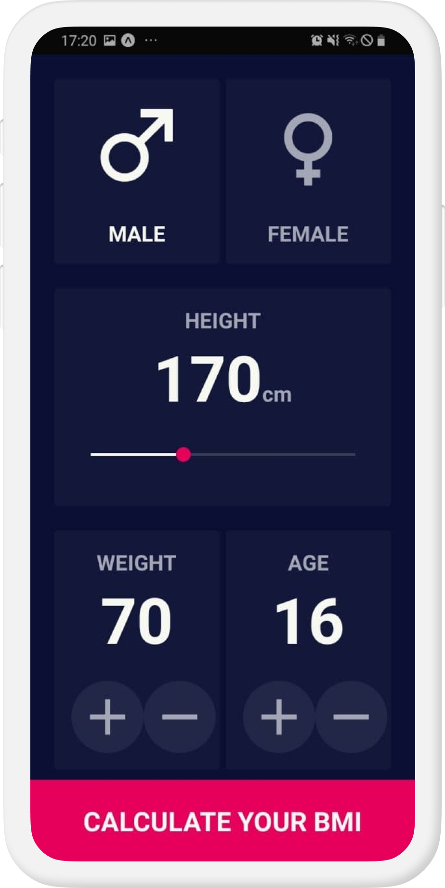
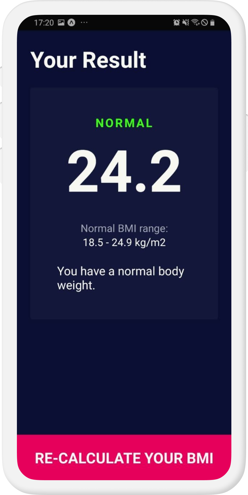

<div align="center">
  <!--  -->
  <h1>
    expo-bmi-calc
  </h1>
  <blockquote>
    A BMI calculator made with React Native & Expo
  </blockquote>
  <div id="badges">
    
    
    
  </div>
</div>
    
## Table of contents

   * [About the project](#-about-the-project)
      - [Screenshots](#-screenshots)
      - [Technologies](#-technologies)
      - [How to run](#-how-to-run)
   * [How to contribute](#-how-to-contribute)
   * [License](#-license)

## 💻 About the project

This is a BMI calculator made with React Native & Expo

### 📷 Screenshots

<div>
  
  
</div>

### 🛠 Technologies

The following technologies were used in the construction of the project:

- [Expo](https://expo.io/)
- [React Navigation V5](https://reactnavigation.org/)
- [Styled Components](https://styled-components.com/)

### 🚀 How to run

#### Clone the repository
```bash
git clone https://github.com/carlos3g/expo-bmi-calc.git
```

#### Install the dependencies
```bash
cd expo-bmi-calc
yarn install
```

#### Run the application
```bash
yarn start
```

#### Download the 'Expo Go' APP

  - [Google Play Store](https://play.google.com/store/apps/details?id=host.exp.exponent)
  - [App Store](https://apps.apple.com/br/app/expo-client/id982107779)

#### Using the mentioned APP, Scan the QR Code opened in step 3

## 🤝 How to contribute

Every kind of contribution is welcome, we admire it!

Is there any problem? Found a bug? Do you have any tips? Open an [issue](https://github.com/carlos3g/expo-bmi-calc/issues) describing it.

Want to contribute code? We ask that you first read [this contribution guide](https://github.com/firstcontributions/first-contributions)

Don't forget to leave your ⭐, it is also a way to contribute to the project;) 

## 📝 License

This project is under the MIT license. See the file [LICENSE](LICENSE) for more details.

---
<div align="center">

  Created by [Carlos Mesquita](https://github.com/carlos3g) 💜

</div>